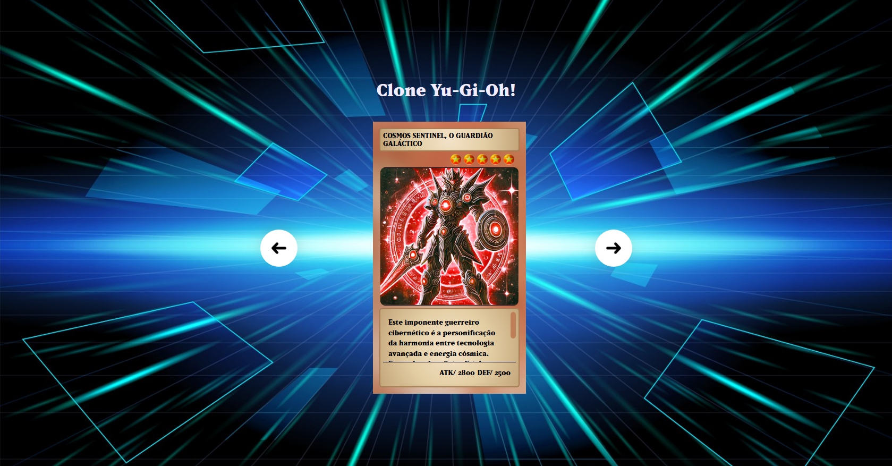
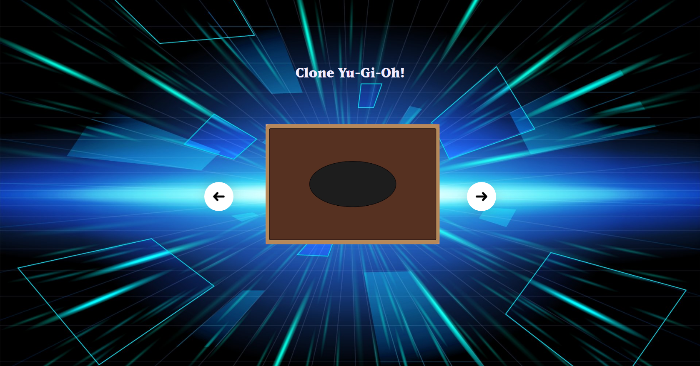
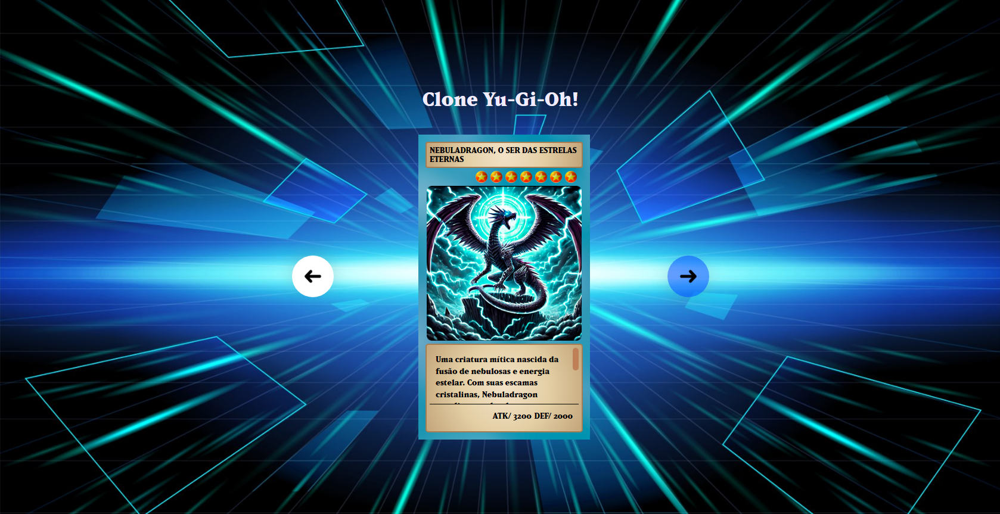

# Projeto Clone Yu-Gi-Oh

 

## Este foi o projeto que aprendi no YouTube da Hashtag

Este repositório contém um clone de um jogo inspirado em Yu-Gi-Oh, onde os usuários podem jogar cartas e interagir com mecânicas semelhantes ao jogo original.

## Introdução

O projeto visa reproduzir a experiência de um jogo de cartas, permitindo que os usuários joguem e aprendam sobre as regras e estratégias do Yu-Gi-Oh. A interface é projetada para ser intuitiva e acessível.

## Tecnologias utilizadas
* HTML
* CSS
* JavaScript
* JSON

## Ferramentas
* Node.Js
* Git
* GitHub
* Visual Studio Code
* Navegador Web

## Rodando o projeto

<a href="https://daniel-pantoja.github.io/clone-yu-gi-oh/">Acesse aqui</a>

## Status do projeto
:heavy_check_mark: Aplicação finalizada.